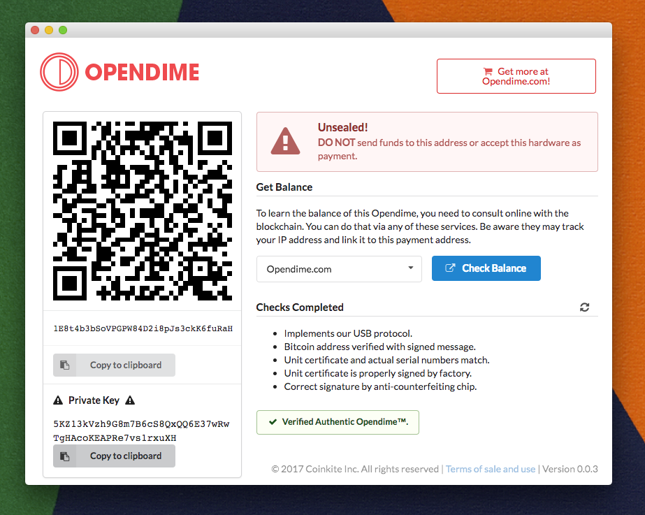

# What is this?

We all us use Chrome everyday, and yet we just discovered that Chrome
extensions can be given permission to connect to your USB devices!
Once we heard this, we had to make this extension that communicates
with Opendime over USB.

This extension can:

- load the random numbers (256k bytes) to initialize new Opendimes
- read the bitcoin payment address, and link to public block explorers
- perform an in-depth verification of the Opendime, including:
    - bitcoin messages signature (using a unique nonce each time)
    - factory certificate verification
    - verification by signed message (with nonce) to the anti-counterfieting chip
- be easy to use

Once installed, all of the above is done just by plugging in an Opendime!

# How to Install

Go to the Chrome Web Store, and click **Add Extension**, and you're done!

[Get the Opendime App here](https://chrome.google.com/webstore/detail/opendime-app/nfmngebojjibkjhffecplcdeagndcahl)

# Screen Shot




# Web References

## Submodules / Components used

- <https://developer.chrome.com/apps> top level docs
- <https://developer.chrome.com/apps/app_usb> USB interface stuff
- <https://developer.chrome.com/apps/api_index> useful index page
- <http://semantic-ui.com/examples/theming.html> Semantic UI CSS cheatsheet
- <https://davidshimjs.github.io/qrcodejs/> for QR code rendering
- <http://pkijs.org/> x.509 ertificate stuff
- <https://github.com/indutny/elliptic> EC curve stuff
- <https://github.com/bitcoinjs/bitcoinjs-lib> Bitcoin stuff

## Useful Chrome internal links

- <chrome://extensions> keep open all the dev time
- <chrome://device-log> lists USB events!

## For HTML and Front End Devs

- look at the end of `code.js` for some things that can be commented one
  way or the other; you can make it display test data for most cases
- App window is currently coded to be 840x640px but we can change that. You should
  work in a similarly-sized window.
- simply load `main.html` into chrome from the filesystem:

```
open main.html
```


# Debug As Extension.

To debug/change it as an extension, go to `chrome://extensions/` and...

- click "Developer mode"
- click "Load unpacked extension"
- give it this directory (ie. where `manifest.json` is located)
- Use the Launch and/or Reload buttons
- once installed, will also pop up any time an opendime is inserted


# Life Cycle

Chrome "apps" are depreciated and going away. However, "extensions"
do not support USB, so we are an "app" today. Still, it's listed
under 'extensions' in all Chrome UI (present version), but since
we are an "app", the contents of `manifest.json` is quite limited.

Also the top of every page in the google docs, they warn us:

_Important: Chrome will be removing support for Chrome Apps on
Windows, Mac, and Linux. Chrome OS will continue to support Chrome
Apps. Additionally, Chrome and the Web Store will continue to support
extensions on all platforms. Read the announcement and learn more
about migrating your app._

Timeline for app non-support is 2018, and WebUSB won't be ready
for years anyway. Let's just take it one day at a time.

# NW.js

This app works well with [NW.js](https://nwjs.io/) without any changes.
Going forward, a few changes would fix URL openning and improve the native
menus and such.

To try it with NW.js, first download NW.js for your platform. Then
run the executable (`NW.exe` or `nwjs`) from this directory
with `.` (just dot) as the first argument.


